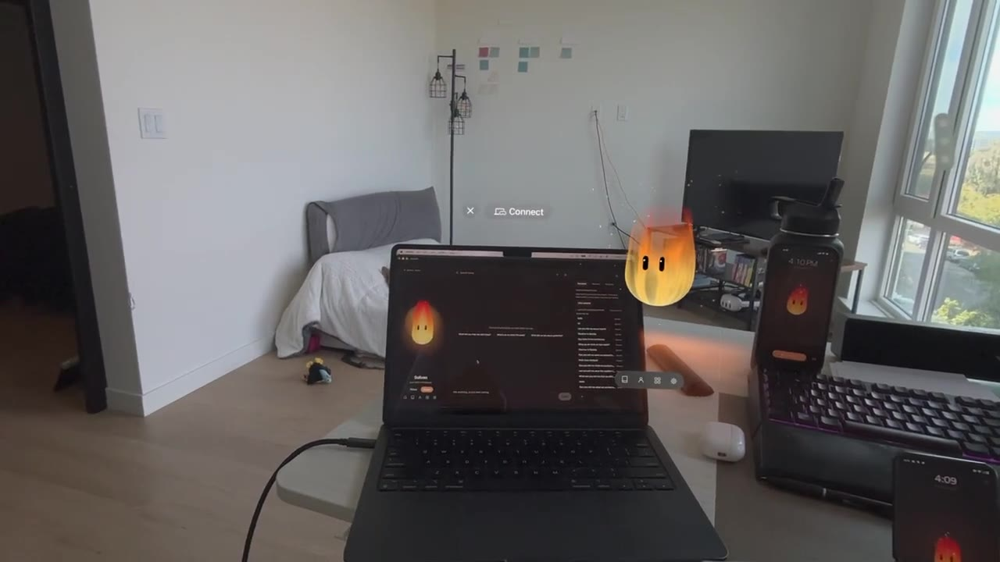
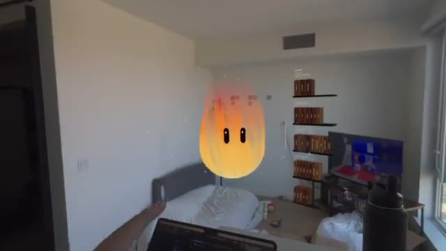

<p align="center">
  
</p>

# Hearth

A companion that lives on your own machine.

Your conversations, your memory, and your persona's voice stay on your
hardware. Nothing is sent anywhere, because there is nowhere for it to go.

<p align="center">
  <a href="https://raw.githubusercontent.com/XXJones21/Hearth/main/design/media/sulivan-idle-desktop.mp4">
    
  </a>
  <br>
  <sub>Sulivan, idle, on the desktop.</sub>
</p>

Underneath: Gemma 4 for the brain, served by llama.cpp's llama-server, the
12B quantization-aware build on larger GPUs and the E4B or E2B builds on
smaller machines. OmniVoice for the voice, through omnivoice.cpp, which
designs a voice from a few attributes and then clones it sentence by
sentence. A Whisper base model for hearing. The hearth-probe crate scans the
machine and picks the tier.

Hearth is pre-alpha. If you are not expecting it to be rough, wait.

## What it does

You meet Sulivan, the one resident, and you make a persona of your own: a
name, a temperament, a voice, a colour. From then on that persona is who
greets you. See [personas](wiki/features/personas.md).

Every persona speaks in a voice designed from plain attributes such as age,
pitch and accent, cloned on your machine every turn. It can place a few
non-verbal tags in a reply, such as `[laughter]` and `[sigh]`, and the engine
performs them instead of reading them. It has a face: two capsule eyes that
blink, glance and react, drawn from one motion design on every screen. See
[voice](wiki/features/voice.md) and
[the persona face](wiki/features/persona-face.md).

Its memory is four folders of markdown on your disk: projects, areas,
thoughts, resources. Open them in any editor. Delete what you like. See
[the second brain](wiki/features/second-brain.md).

It can put a card on your screen from a small closed layout vocabulary, and
reach into the world through tools. See
[apps and extensions](wiki/features/apps-and-extensions.md).

The desktop machine is the house. It runs the model, the persona and the
memory. The phone and the headset are windows onto it, at home or over a
tailnet.

## See it

Each still links to its clip.

<a href="https://raw.githubusercontent.com/XXJones21/Hearth/main/design/media/all-clients-from-vision-pro.mp4">
  
</a>

**Every client at once** (11 s). Windows, macOS, iPhone, Android and Apple
Vision Pro on one house, seen from the headset.

<a href="https://raw.githubusercontent.com/XXJones21/Hearth/main/design/media/visionos-walkthrough-sulivan-flame.mp4">
  
</a>

**Sulivan in the room** (94 s). A visionOS walkthrough of the flame body,
with a second brain session.

## What you need

A Windows machine with a capable GPU, or an Apple Silicon Mac (M1 or later)
with 8 GB of memory or more. On Windows the smallest supported tier is a GPU
with around 8 GB of video memory; larger GPUs run larger models with more
headroom. On a Mac, 8 GB is the floor, and it is supported in full: an 8 GB
M2 MacBook Air runs a persona and its voice at the same time. What first run
does with what it finds is in [getting started](wiki/getting-started.md).

## What is here

```
desktop-client/     The app. Tauri v2, React, TypeScript. Supervises the backend.
backend/            The harness: gateway, personas, tools, memory, voice.
crates/
  hearth-probe/     Looks at a machine and decides what Hearth it can run.
apple-client/       The iOS and visionOS apps.
android-client/     The Android app. Compose; a phone client and a cover-screen home.
vendor/             Voice engine sources built during packaging.
scripts/            Builds the backend tarball the installer bundles.
design/             Icons, and the stills and clips this page uses.
wiki/               How it works, and why it is built this way.
```

The client bundles the backend and supervises it as a tree of native
processes. No WSL, no container. An installed house runs a model server, a
gateway, and a voice engine, all started and watched by the app.

## Alpha builds

Download the installer, run it, and meet Sulivan. The installer scans your
hardware, picks a model and downloads it; what happens after that is
[first run](wiki/first-run.md).

The first packaged alpha (0.1.0) covers three platforms. iOS and visionOS
come later through TestFlight; they are built but need Apple's pipeline.

**Windows.** An installer built with the ship loop:
`desktop-client/src-tauri/target/release/bundle/nsis/` after
`bash scripts/pack_backend.sh && npm run tauri build`.

**macOS.** The same app, built on a Mac; the procedure for every platform
is [`wiki/releasing.md`](wiki/releasing.md).
The alpha dmg is unsigned: right-click, Open, once, and it opens normally
after that.

**Android.** A signed APK from
`cd android-client && ./gradlew assembleRelease` (signing needs a
`keystore.properties` beside the keystore; both stay out of the repository).
Sideload it, then point it at a house: the phone client pairs with a running
desktop install from Settings, and reaches it away from home over a tailnet
if the house is on one.

The Android and Apple clients are companions to a house, not houses: one
desktop install carries the models and the memory, and the small screens
connect to it.

## Running the client from source

```
cd desktop-client
npm install
npm run tauri dev
```

For the full loop, including how backend changes reach the bundle, start at
[`wiki/developing.md`](wiki/developing.md).

## The probe

The hardware scan is its own crate, so the app, a command line, and a
scripted installer all reach the same conclusions.

```
cargo run -p hearth-probe -- explain
cargo run -p hearth-probe -- explain --simulate m1-air-8gb
cargo run -p hearth-probe -- verify
```

`explain` says what this machine should run and why. `--simulate` pretends to
be a different machine, which is how the small-machine path gets tested from a
machine that is not small. `verify` checks that every model in the dictionary
still resolves.

## Reading further

Start at [`wiki/_index.md`](wiki/_index.md).

The two articles worth reading first are
[first run](wiki/first-run.md), which is what a person meets, and
[developing](wiki/developing.md), which is how you build and change it.

## A note on history

This repository starts in August 2026 with a working client and no commits
behind it. The work is older than that: it grew inside a personal project
called Valinor, which remains the testbed and carries things that will never
ship here.

What did not come across is commit archaeology. What did come across is the
comments, and there are a lot of them, because most of what is hard about this
software is not visible in the code that survived. When a comment explains why
something is the way it is, it is usually because getting there cost a day.
